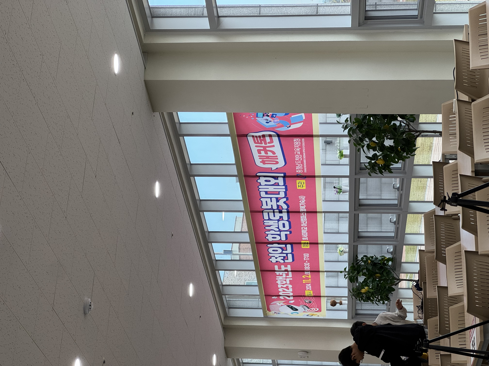
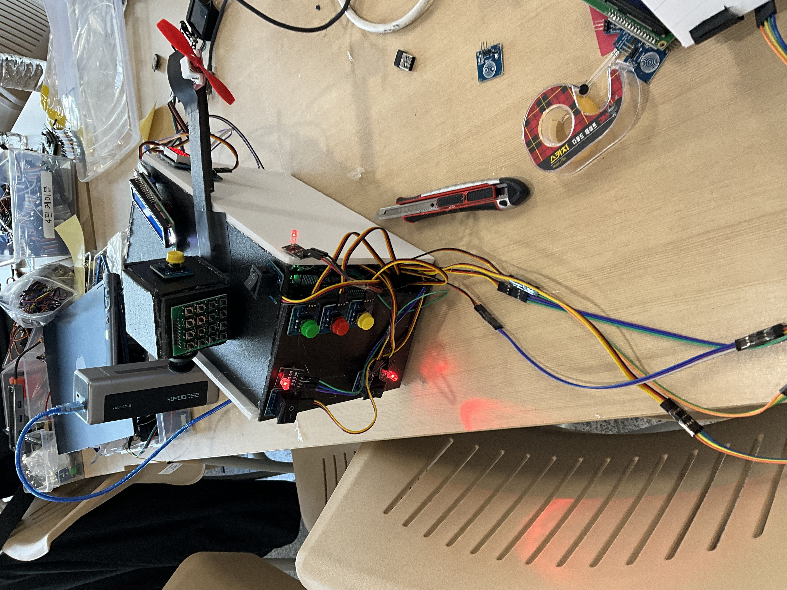
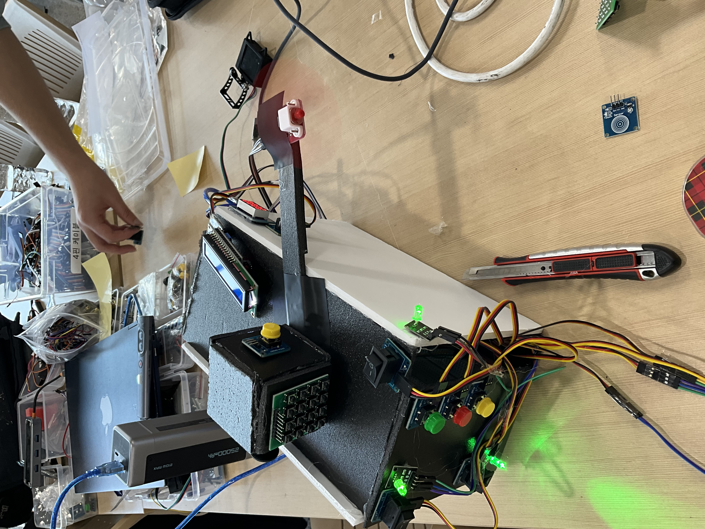

# 2024 제 5회 천안학생로봇대회
해커톤, 로봇코딩미션주행, 로봇윤리토론 세 종목
 
해커톤 주제 : 학교와 일상생활에 도움을 주는 장치
 
-> 책상 위에서 사용할 수 있게 제작
 
책상 위에서 사용할 수 있는 졸음 방지 장치
  
개 사고 발생 : 한 아두이노에 센서들 몰아넣어서 전력 부족 사태 발생 -> 아두이노 두 개로 역할 분할
  
피젯토이 : 4x4 매트릭스 키패드, 버튼, 레버, 조이스틱 등으로 구성
 
본품 : 본품 전원 시스템, 허스키렌즈 전원 시스템, 졸음을 날려 버릴 선풍기, 공부 타이머
 
허스키렌즈 : 졸음 감지시 건틀렛에 있는 진동 모터 3개 작동
 

